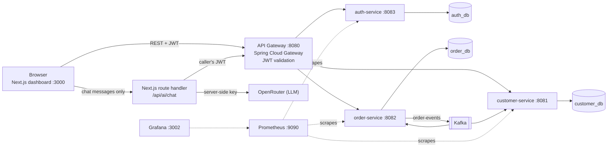

# Customer Management System

A microservice CRM: customers, orders and users behind an API gateway, order events over Kafka, a Next.js dashboard with an AI assistant, and Prometheus/Grafana monitoring. Everything runs locally with one `docker compose up`.

## Architecture



Four Spring Boot services (gateway, auth, customer, order), one PostgreSQL database per service, Kafka for order events, and two Next.js apps (the CRM dashboard and a small n8n-backed AI agent UI).

| Component | Technology |
|-----------|-----------|
| Frontend | Next.js 16 (App Router), React, MUI 9, TypeScript |
| Gateway | Spring Cloud Gateway (WebFlux), JWT check, upstream timeouts, restricted CORS |
| Services | Spring Boot 4.0 (auth-service is still on 3.3, see Known limitations), Spring Security, JPA, Flyway |
| Data | PostgreSQL 16, one database per service, Flyway migrations with seed data |
| Messaging | Kafka (order-service produces `order-events`) |
| Observability | Actuator + Micrometer, Prometheus, Grafana |
| AI | OpenRouter, called only from a Next.js server route |

## Run it locally

Requirements: Docker Desktop. No cloud account is needed.

```bash
git clone <this repo> && cd customer-management
cp .env.example .env
# put a random value into JWT_SECRET:  openssl rand -hex 32
# optional: OPENROUTER_API_KEY for the AI assistant (without it the chat answers 503)
docker compose up --build
```

| What | URL |
|------|-----|
| Dashboard | http://localhost:3000 |
| API gateway | http://localhost:8080 |
| AI agent UI | http://localhost:3001 |
| n8n | http://localhost:5678 |
| Prometheus | http://localhost:9090 |
| Grafana | http://localhost:3002 (admin / value of `GRAFANA_ADMIN_PASSWORD`) |

Only these entry points are published to the host. Databases, Kafka and the three backend services are reachable only inside the compose network, so nothing else on your machine can talk to them.

### Your data survives restarts

Database data lives in a named Docker volume. `docker compose up -d` after a reboot or after `docker compose stop` / `down` brings everything back with all records intact; containers also restart automatically (`restart: unless-stopped`). The only command that deletes the data is `docker compose down -v` (or `docker volume rm`), so do not use `-v` unless you want a clean slate.

Demo accounts (seeded by Flyway in auth-service):

| Role | Username | Password | Can do |
|------|----------|----------|--------|
| ADMIN | `admin` | `admin123` | everything, including prices, revenue, user management |
| USER | `user1` | `user123` | read customers and orders, no financial data |

These credentials are demo data. Change them before exposing the stack anywhere.

## Security model

- **Gateway** validates the JWT on every request except login/register and forwards the verified user and role to the services; anonymous calls get `401`.
- **Roles are enforced in the services**: reading customers and orders needs any signed-in user, creating/changing/deleting them needs ADMIN, and order prices are returned as `null` to non-admins, so the restriction holds for curl/Postman as well as for the UI. Public self-registration always creates a USER. `OrderApiAuthorizationTest` and `CustomerApiAuthorizationTest` run the real security chain.
- **Passwords** are hashed with BCrypt. The JWT secret has no default: `docker compose` refuses to start without `JWT_SECRET`.
- **Network exposure**: only gateway, frontends, n8n, Prometheus and Grafana are published. DB and Kafka ports are internal.
- **CORS** is limited to the two frontend origins (`CORS_ALLOWED_ORIGINS` to change).
- **Gateway timeouts**: 3 s connect, 15 s response, so a hung service cannot pile up connections.
- **Token storage**: the JWT is kept in `localStorage`. That is simple but readable by any script on the page (XSS). A production version would use an `HttpOnly`, `SameSite` cookie; see the cookie + Origin-check design in the sibling projects.
- **Money**: prices are `NUMERIC` in PostgreSQL; a Jackson serializer prevents scientific notation.

### AI assistant: data handling

- The OpenRouter key is read only by the Next.js server (`src/app/api/ai/chat/route.ts`); the browser sends chat messages only.
- The route fetches customers and orders itself with the caller's JWT, so the backend decides what the caller may see.
- E-mail addresses and phone numbers are never sent to the model. Prices and revenue are sent for `ADMIN` only. Lists are capped (200 customers, 500 orders).
- Stored data is passed as an untrusted `<DATA>` block and the model is told not to follow instructions inside it. This reduces prompt-injection risk; it does not remove it.
- Limits: 20 messages per request, 2000 characters per user message, 30 s upstream timeout, 20 requests/min per user (in memory, per instance).
- If an API key was ever committed or exposed to a browser bundle, treat it as leaked and rotate it.

## Order events and idempotency

`order-service` publishes `order-events` after an order is created. Kafka delivers at least once, so the consumer stores `group:topic:partition:offset` in a `processed_event` table (primary key) in the same transaction as the handling step. A redelivered record is skipped; a concurrent duplicate loses on the primary key and is retried. Failed records are retried three times (3 s apart) and then published to `order-events.DLT`.

Honest scope: the event payload is a plain notification string and the handler currently logs it. The idempotency and dead-letter plumbing is real; a business side effect (stock, e-mail, analytics) would plug into `OrderConsumer.handle`. `customer-service` also consumes the topic and only logs.

## Tests and checks

```bash
# backend, per service
cd order-service && ./mvnw verify      # unit tests + PostgreSQL Testcontainers test (needs Docker)
cd customer-service && ./mvnw verify
cd auth-service && ./mvnw verify

# frontend
cd frontend/customer-app && npm ci && npm run lint && npx tsc --noEmit && npm run build
```

The Testcontainers test runs the real Flyway chain on PostgreSQL with Hibernate in `validate` mode and checks that a redelivered Kafka record is recorded once. It is skipped automatically when Docker is not available. The other service tests use H2.

## API summary

All routes go through the gateway on `:8080`; protected routes need `Authorization: Bearer <token>`.

| Area | Endpoints | Access |
|------|-----------|--------|
| Auth | `POST /api/auth/login`, `POST /api/auth/register` | public |
| Customers | `GET/POST /api/customers`, `PUT/DELETE /api/customers/{id}` | read: any user, write: ADMIN |
| Orders | `GET/POST /api/orders`, `PUT/DELETE /api/orders/{id}` | read: any user, write: ADMIN |
| Users | `GET /api/users`, `PATCH /api/users/{id}/role`, `DELETE /api/users/{id}` | ADMIN |

## Known limitations

- `auth-service` still uses Spring Boot 3.3.x, which is out of open-source support; the other services use 4.0.x. Aligning it is the next upgrade step.
- The JWT lives in `localStorage` (see Security model).
- The in-memory AI rate limiter is per process; behind several instances it would need a shared store.
- `next build` and the Java builds are not part of any CI in this repository yet.
- No cloud deployment is configured on purpose; the project is meant to be demonstrated from `docker compose`.

## License

MIT

## Design decisions
See [docs/DESIGN-DECISIONS.md](docs/DESIGN-DECISIONS.md).
